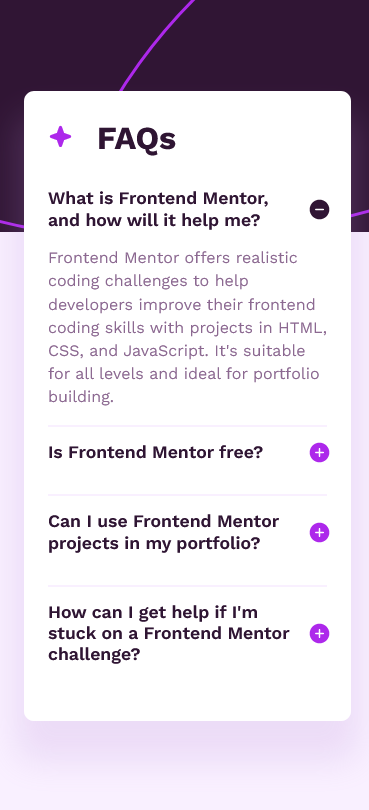

# Frontend Mentor - FAQ accordion solution

This is a solution to the [FAQ accordion challenge on Frontend Mentor](https://www.frontendmentor.io/challenges/faq-accordion-wyfFdeBwBz). Frontend Mentor challenges help you improve your coding skills by building realistic projects. 

## Table of contents

- [Overview](#overview)
  - [The challenge](#the-challenge)
  - [Screenshot](#screenshot)
  - [Links](#links)
- [My process](#my-process)
  - [Built with](#built-with)
  - [What I learned](#what-i-learned)
  - [Useful resources](#useful-resources)
- [Author](#author)
- [Acknowledgments](#acknowledgments)

## Overview

### The challenge

Users should be able to:

- Hide/Show the answer to a question when the question is clicked
- Navigate the questions and hide/show answers using keyboard navigation alone
- View the optimal layout for the interface depending on their device's screen size
- See hover and focus states for all interactive elements on the page

### Screenshot



### Links

- Solution URL: [Add solution URL here](https://your-solution-url.com)
- Live Site URL: [Add live site URL here](https://your-live-site-url.com)

## My process

### Built with

- Semantic HTML5 markup
- CSS custom properties
- CSS Grid
- Mobile-first workflow
- Vanilla JS

### What I learned

Writing the HTML for the accordion, I decided to practice using more semantic tags, the accordion is a `<article>`, I used proper heading levels, and each Q and A is a `<section>` which doubles as a container.The accordion works by having JavaScript add in an `active` class to the corresponding accordion `<section>` when it is clicked or when the `enter` or `space` keys are pressed when the element is in focus.

In order to make the `<h2 class="labels">` tabbable, I added `tabindex="0"` attribute. In order to make them also accessible by keypresses, I had to add some JavaScript keydown event listeners to each of them. I did the same with making them clickable.

```js
const accordionSection = document.getElementsByClassName('container');
const labels = document.querySelectorAll('.label');

// makes each Q&A clickable in the accordion
for (let section of accordionSection) {
    section.addEventListener('click', function () {
        this.classList.toggle('active');
    })
}

// makes the accordion keyboard accessible
labels.forEach(label => {
    label.addEventListener('keydown', function (e){
        if (e.key === 'Enter' || e.key === ' '){
            e.preventDefault();
            this.parentNode.classList.toggle('active');
        }
    });
});
```

It was a bit tricky getting the background to work like in the design images, as in getting the background to stay on top, but most importantly to have it scale properly in order to ensure responsiveness. Here is what I did.

```css
body {
    /* [...] */

    /* background pattern properties */
    background-color: var(--pink);
    background-image: url("assets/images/background-pattern-mobile.svg");
    background-size: 100% auto;
    background-position: top;
    background-repeat: no-repeat;
}
```
I also tried to make better use of custom properties in this project, ensuring that every color, font property, can be changed quickly and easily. For the next project I'll try to find a way to make better use of custom properties for margins and paddings as well.

```css
  :root {
    /* colors */
    --white: hsl(0, 0%, 100%);
    --pink: hsl(275, 100%, 97%);
    --purple: hsl(292, 16%, 49%);
    --dark-purple: hsl(292, 42%, 14%);
    --shadow: hsla(276, 49%, 70%, 0.20);
    --bg-dark: hsl(292, 42%, 14%);

    /* typography*/
    --ff: 'Work Sans', sans-serif;
    --fs: 16px;
    --fstyle: bold;
    --fs-heading: 1.1rem; 
    --lh: 1.45;
    --lh-heading: 1.2;
    --fw-400: 400;
    --fw-600: 600;
    --ff-700: 700;

    --star-size: 25px;
}
```

This was also the first time I've made use of the `::before` and `::after` pseudo-elements. It was a bit tricky to use at first but I realized the easiest way to make the icon appear was using the background-image property.

```css
.accordion-header::before {
    content: "";
    display: inline-block;
    background-image: url("assets/images/icon-star.svg");
    background-size: var(--star-size) var(--star-size);
    height: var(--star-size);
    width: var(--star-size);
    margin-right: 1.5rem;   
}
```

### Useful resources

- [How to Build an Accordion Menu Using HTML, CSS and JavaScript](https://www.freecodecamp.org/news/build-an-accordion-menu-using-html-css-and-javascript/) - The FreeCodeCamp tutorial on accordions helped me tremendously! I have adapted it for use in this project but made some modifications.

## Author

- Frontend Mentor - [@JChavezSharp](https://www.frontendmentor.io/profile/JChavezSharp)
- X aka Twitter - [@JChavezSharp](https://twitter.com/JChavezSharp)

## Acknowledgments

Thanks to Kevin Powell's YouTube channel for his excellent CSS tutorials and to John Duckett for his book HTML & CSS.